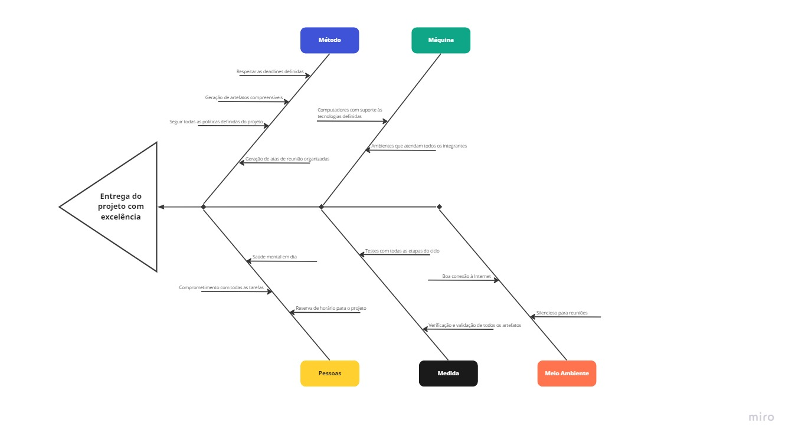
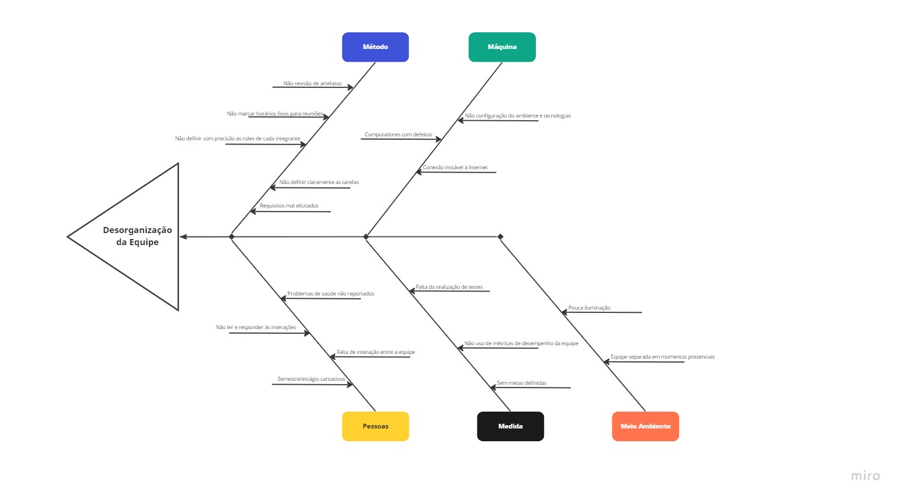

## Histórico de Versões

|    Data    | Versão |            Descrição           |       Autor     |    Revisor    |
|  --------  |  ----  |            ----------          | --------------- |    -------    |
| 10/11/2022 |  1.0.0 |  Criação do artefato de Diagrama Causa-Efeito    |   Victor Leão    |       -       |

## Introdução & Objetivo

O Diagrama Causa-Efeito (ou de Ishikawa) analisa causas sobre diferentes pontos de vistas que podem gerar, consequentemente, um efeito. Com isso, o diagrama também pode trazer conhecimentos acerca de problemas ou riscos que podem vir a serem observados no decorrer do projeto. É importante mencionar que essa estratégia também pode ser usada com intuitos positivos da equipe e não somente com efeitos não desejados.

Na representação do diagrama, as espinhas principais são as categorias (causas gerais) do problema e suas espinhas menores representam causas mais específicas relacionadas à categoria.

O objetivo, então, do Diagrama Causa-Efeito é, a partir de um efeito (risco) percebido, levantar, sobre diferentes perspectivas, causas para o efeito desejado. A partir de sua criação, a equipe é capaz de propor ações corretivas, acompanhar tais ações e gerar relatório por problema solucionado.

## Metodologia

A partir do entendimento da estratégia, foram detectados dois efeitos (gerando, assim, dois diagramas) para a criação dos diagramas. O primeiro é relacionado à entrega de um projeto de excelência pela equipe (objetivo principal buscado) e o segundo é acerca da desorganização da equipe, que pode ser vista como um desafio em certos momentos durante todo o ciclo do projeto. Após isso, foram escolhidas as categorias para as causas e, por fim, as causas em si foram levantadas para cada uma das categorias.

Para a escolha das categorias, foram escolhidas de diversas abordagens, sendo selecionadas, então:
- Método: relacionadas ao processo e aos procedimentos, ou seja, como o trabalho é realizado.
- Máquina: relacionadas às máquinas e equipamentos.
- Pessoas: relacionadas às pessoas envolvidas no processo.
- Medida: relacionadas a como o processo é mensurado.
- Meio ambiente: características do ambiente em que o processo ocorre, tais como temperatura, umidade etc.

Foi utilizada a plataforma miro para o desenvolvimento dos diagramas.

## Diagramas Gerados
### 1. Diagrama - Projeto de Excelência

### 2. Diagrama - Desorganização da Equipe

## Referências

SERRANO, Milene. Causa-Efeito, 2022. Material apresentado na Disciplina de Arquitetura e Desenho de Software do curso de engenharia de software da UnB, FGA.

LIMA, Raphael H. P. Diagrama de Ishikawa (Ferramenta da Qualidade): Teoria + Exemplo Prático. Aprendendo Gestão, 23 de setembro de 2016. Disponível em: https://www.youtube.com/watch?v=U-0qzmFqH-0.