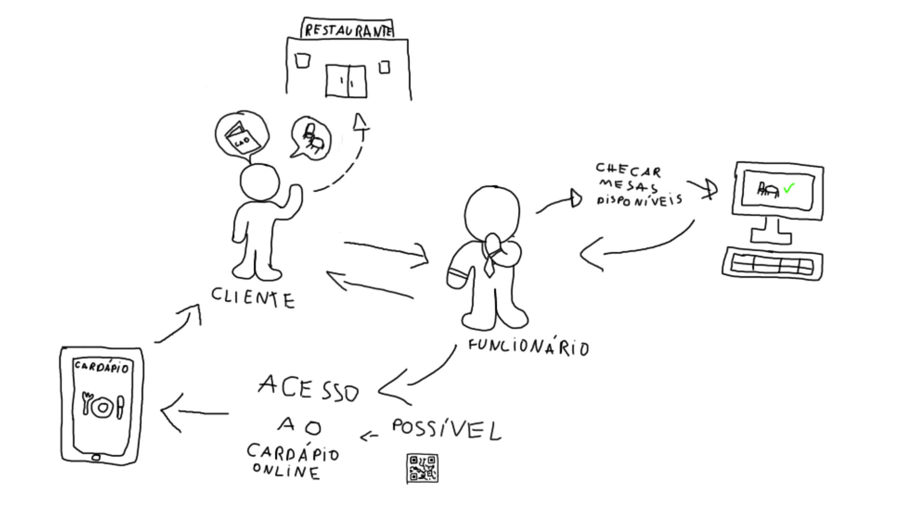
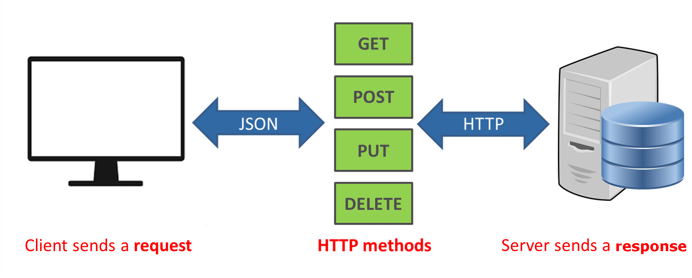
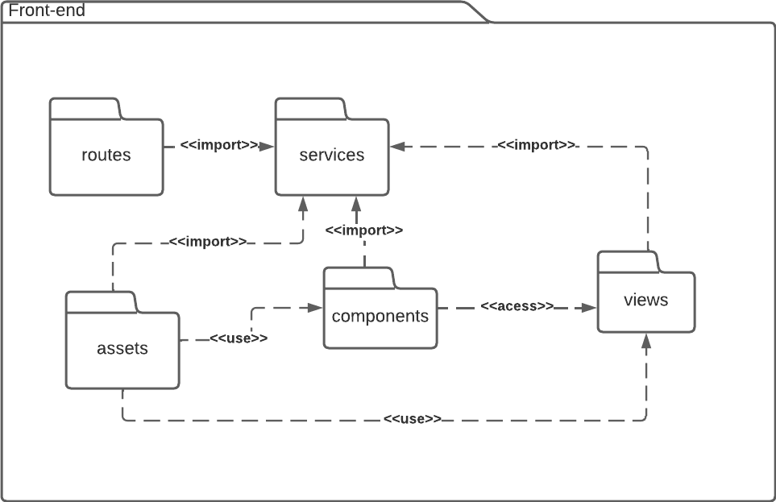

# DAS - Documento de Arquitetura de Software

## 1. Introdução

O Documento de Arquitetura de Software (DAS) é um artefato que apresenta a arquitetura de um projeto de software desenvolvido em diferentes visões. Para o software Soft SteakHouse, o DAS apresentará as visões arquiteturais de Casos de Uso, Lógica, Implantação, Implementação e Dados (camada de persistência). Além disso, Tamanho e Performance também serão tópicos analisados no artefato.

### 1.1 Propósito

Como explicitado acima, o propósito desse documento é apresentar uma visão geral arquitetural do sistema a partir de diferentes visões arquiteturais, detalhando, assim, diferentes aspectos do sistema. Busca-se capturar e mostrar as decisões arquiteturais significantes que foram feitas ao longo do desenvolvimento do software Soft SteakHouse.

### 1.2 Escopo

O Documento de Arquitetura de Software se aplica ao projeto Soft SteakHouse desenvolvido no segundo semestre de 2022 (2.2022) da Universidade de Brasília para a disciplina Arquitetura e Desenho de Software. Com esse artefato, a arquitetura do projeto é explicada e destrinchada, afetando e influenciando quem buscar por tais informações (desde a equipe de desenvolvimento até interessados pela arquitetura utilizada).

De forma geral, o projeto possui o foco em resolver problemas para restaurantes que desejam passar por um processo de digitalização de alguns de seus serviços. Como pode ser melhor observado no [Product Backlog](https://unbarqdsw2022-2.github.io/2022.2_G5_SoftSteakHouse/#/modelagem/agil/backlog) da aplicação, as funcionalidades que receberam maior enfoque e, portanto, são essenciais para o produto, foram a de apresentação de cardápio digital e gerenciamento de mesas, além do acesso pelo administrador do restaurante.

O escopo imaginado da aplicação, juntamente com uma visão mais geral conceitual da mesma, pode ser vista de forma mais completa em alguns artefatos:

- [Mapa Mental](https://unbarqdsw2022-2.github.io/2022.2_G5_SoftSteakHouse/#/base/abordagem-geral/mapa_mental)

<figcaption>Imagem: Exemplo Mapa Mental do Projeto</figcaption>
<figcaption>Autor: Caio (Integrante do Grupo)</figcaption>

- [Rich Picture](https://unbarqdsw2022-2.github.io/2022.2_G5_SoftSteakHouse/#/base/abordagem-geral/rich_picture)

<figcaption>Imagem: Exemplo Rich Picture do Projeto</figcaption>
<figcaption>Autor: Hian (Integrante do Grupo)</figcaption>

### 1.3 Definições, acrônimos e abreviações

A tabela abaixo possui algumas definições, acrônimos e abreviações importantes que deve-se conhecer para interpretar o DAS. 

| Abreviação | Acrônimo | Definição |
| :--------: | :------: | :-------- |
| DAS | Documento de Arquitetura de Software | Artefato desenvolvido nessa página, que apresenta a arquitetura do projeto Soft SteakHouse com diversas visões |
| MTV | Model Template View | Modelo arquitetural dividido em 3 camadas usado pelo framework Django em Python |
| SGBD | Sistema Gerenciador de Banco de Dados | Software usado para gerenciar e manipular a base de dados (armazenamento persistente) do projeto |
| AWS | Amazon Web Services | Serviços de nuvens da empresa Amazon |

O artefato de [léxicos](https://unbarqdsw2022-2.github.io/2022.2_G5_SoftSteakHouse/#/base/abordagem-geral/lexicos) também ajuda a entender alguns outros termos relacionados ao projeto.

### 1.4 Visão Geral

A partir da introdução, pode-se entender um pouco o quê é o DAS e seu propósito, então, abaixo, o documento se expande, apresentando a arquitetura do projeto, desde uma forma geral, até cada uma das visões (lógica, implementação, implantação e dados).

## 2. Representação Arquitetural

Antes de explicar a arquitetura do sistema em diferentes visões, é importante entender a divisão inicial de frameworks no back-end (onde a lógica de negócio é desenvolvida) e front-end (apresentação para o usuário). É interessante mencionar que no projeto existem [templates de implementação](https://unbarqdsw2022-2.github.io/2022.2_G5_SoftSteakHouse/#/templates-implementacao/templates) para as duas frentes, auxiliando tanto os desenvolvedores na aplicação, quanto para quem deseja entender como o sistema está sendo desenvolvido.

### 2.1 Back-End

Primeiramente, para o back-end, foi escolhida a linguagem Python para o desenvolvimento. O motivo de tal seleção foi, principalmente, pela familiaridade por maior parte dos integrantes do grupo, além da concordância geral que o desenvolvimento de uma aplicação web poderia ser beneficiado por certos frameworks disponíveis para a linguagem.

Assim, o framework Django foi selecionado, também por causa do conhecimento e experiência prévia de membros da equipe e, portanto, o risco para o desenvolvimento seria menor e menos tempo seria gasto no aprendizado da ferramenta. Como modelo arquitetural, então, foi adotado, "automaticamente" o [MTV (Model Template View)](https://unbarqdsw2022-2.github.io/2022.2_G5_SoftSteakHouse/#/padroes-projeto/padrao-extra/django), uma vez que é o padrão implementado pelo framework.

### 2.2 Banco de Dados

O SGBD usado no projeto foi o sqlite3, uma vez que é o sistema gerenciador padrão implementado pelo Django e os dados armazenados pelo projeto são relacionais.

A ferramenta AWS é encontrada, também, no projeto para o armazenamento das imagens dos itens, similar a um repositório. A tecnologia trabalha em forma de nuvem.

### 2.3 Front-End

Por outro lado, para o front-end, o desenvolvimento foi realizado com a linguagem JavaScript, a partir da biblioteca React. Essa ferramenta foi selecionada pelo mesmo motivo das escolhas de back-end, sendo então, a familiaridade e entendimento já existente por alguns membros do grupo, o principal deles. Além disso, é uma biblioteca com grande utilização pelo mercado, o que facilita o trabalho de buscas e pesquisas para o desenvolvimento.

A ferramenta Docker também foi implementada para a integração em ambiente isolados, para que todos os membros pudessem executar a aplicação de forma semelhante independente de sua configuração pessoal.

## 3. Metas e Restrições Arquiteturais

### 3.1 Metas

Abaixo estão listados alguns requisitos e objetivos do software que têm impacto significativo na arquitetura.

| Categoria | Metas |
| :-------: | :---- |
| Segurança e confiabilidade | A aplicação deve garantir proteção aos dados sensíveis dos usuários. Falhas ou erros devem ser reportados ao usuário. O sistema deve fornecer a capacidade de autenticação com credenciais únicas (cada usuário é identificado unicamente por um e-mail e senha). |
| Portabilidade e suportabilidade | O usuário deve ser capaz de acessar a aplicação web em navegadores tanto de desktop, quanto mobile. |
| Responsividade | As páginas desenvolvidas devem ser responsivas ao tamanho de tela do usuário. |
| Escalabilidade | O software deve ser desenvolvido para suportar novas evoluções (escalar), tanto de funcionalidades, quanto de dados. |

### 3.2 Restrições

Algumas restrições especiais também são aplicadas à arquitetura, abaixo elas estão listadas.

| Categoria | Restrições |
| :-------: | :--------- |
| Conectividade | O usuário deve estar conectado à internet para utilizar o sistema. O usuário deve ter acesso a um navegador da web. |
| Idioma | As funcionalidades desenvolvidas devem estar em português. |
| Cronograma | O sistema deve estar disponível até, pelo menos, o fim do segundo semestre de 2.2022 da Universidade de Brasília (18 de fevereiro de 2023). | 
| Estrutura do Time | A equipe segue a estrutura da [metodologia ágil](https://unbarqdsw2022-2.github.io/2022.2_G5_SoftSteakHouse/#/base/proce-metod-aborda/escolhas_metodologicas) Scrum. A equipe é formada de 8 membros. |
| Ferramentas de desenvolvimento | React (front-end), Django (back-end) e sqlite3 (SGBD) |

## 4. Visão de Caso de Uso

Para guiar melhor ainda o Documento de Arquitetura de Software que está sendo lido, essa seção vai listar algumas das funcionalidades mais significantes da aplicação para trazer uma compreensão mais elaborada do sistema que foi desenvolvido. Além disso, essas funcionalidades podem refletir e explicar, de alguma forma, algumas das escolhas e decisões arquiteturais tomadas. Como não foi feito um artefato de casos de uso para os requisitos do projeto durante a parte de elicitação, abaixo serão especificadas histórias de usuário e, como deve-se indicar as mais importantes, serão destacadas a com priorização 'Must' (a maior na técnica de priorização MoSCoW). Importante mencionar que essas histórias de usuário podem ser encontradas mais detalhadas no [Product Backlog](https://unbarqdsw2022-2.github.io/2022.2_G5_SoftSteakHouse/#/modelagem/agil/backlog).

- **US04:** Eu, como administrador do sistema, quero poder realizar login para acessar funcionalidades restritas para administradores.
- **US06:** Eu, como administrador, quero poder realizar logout para não estar mais autenticado e não acessar mais funcionalidades e telas restritas.
- **US08:** Eu, como administrador do sistema, quero poder solicitar cadastro para os desenvolvedores por meio do suporte disponível no site para poder acessar minhas funcionalidades específicas.
- **US09:** Eu, como usuário do produto, quero visualizar o cardápio com todos os itens disponíveis do restaurante.
- **US10:** Eu, como usuário do produto, quero visualizar o cardápio separado por categorias, com objetivo de ter uma visão melhor sobre os itens e suas características.
- **US11:** Eu, como administrador do sistema, quero cadastrar novos itens ao cardápio.
- **US12:** Eu, como administrador do sistema, quero editar itens disponíveis no cardápio.
- **US13:** Eu, como administrador do sistema, quero deletar itens disponíveis no cardápio.
- **US16:** Eu, como administrador do sistema, quero visualizar a disponibilidade de mesas para cada quantidade de pessoas.
- **US17:** Eu, como administrador do sistema, quero editar a disponibilidade de mesas para cada quantidade de pessoas.

### 4.1 Realizações de Casos de Usos

Para a aplicação de algumas das funcionalidades citadas acima, foi implementada uma API RESTful com o Django, que conceitualmente pode ser explicada como uma interface que dois sistemas de computador usam para trocar informações de forma segura pela internet, de acordo com a Amazon AWS. Assim, pode-se caracterizar o uso de uma **arquitetura cliente-servidor**, uma vez que um cliente faz requisições/solicitações via protocolo HTTP e, então, ela é processada e respondida por um servidor. A figura abaixo representa bem como funciona uma API RESTful e, de semelhante modo, uma arquitetura cliente-servidor.

<figcaption>Imagem: Funcionamento de uma API RESTful/Arquitetura cliente-servidor</figcaption>
<figcaption>Fonte: phpenthusiast[1]</figcaption>

Dessa forma, as funcionalidades que estão relacionadas a cadastro, edição, deleção e visualização são implementadas por meio dessa arquitetura no sistema.

## 5. Visão Lógica

A Visão Lógica é uma seção que descreve partes, arquiteturalmente, significantes do desenho do sistema, como, por exemplo, sua decomposição em subsistemas e pacotes. Cada pacote significante pode, caso seja necessário, ser decomposto em classes. 

### 5.1 Diagrama de Pacotes

Primeiramente, o Diagrama de Pacotes apresenta a arquitetura do projeto em pacotes e, assim, pode-se entender como a aplicação é desenvolvida de forma lógica. Os diagramas abaixo podem ser encontrados no [artefato](https://unbarqdsw2022-2.github.io/2022.2_G5_SoftSteakHouse/#/modelagem/diagramas_estaticos/diagrama_pacotes) específico dessa diagramação. Entretanto, aqui eles serão explicados cada um de forma mais específica.

<figcaption>Imagem: Diagrama de Pacotes Back-end</figcaption>
<figcaption>Autor: Abraão (Integrante do Grupo)</figcaption>

<figcaption>Imagem: Diagrama de Pacotes Front-end</figcaption>
<figcaption>Autor: Abraão (Integrante do Grupo)</figcaption>

Como pode ser visto, esses diagramas são compostos por pacotes que comunicam entre si e todos são de suma importância para o funcionamento do projeto. Então, para melhor compreensão, eles são explicados:

| Pacotes Pais | Nome | Descrição |
| :----------: | :--: | :-------- |
| Back-end | Settings | Pacote responsável pelas configurações da aplicação Django, além das urls que podem ser acessadas. |
| Back-end -> Settings | Settings Ambiente | Pacote que contém todas as configurações da instalação e funcionamento do sistema Django. | 
| Back-end -> Settings | wsgi | Pacote que especificação para uma interface entre servidores web e aplicações web para Python. |
| Back-end -> Settings | urls | Pacote que contém o mapeamento de todas as urls da aplicação desenvolvida (para requests). |
| Back-end | App N | Pacote com a aplicação realmente desenvolvida. |
| Back-end -> App N | urls | Pacote que implementa as urls da aplicação. |
| Back-end -> App N | views | Pacote com as funções que recebem uma requisição e retorna uma retorna uma resposta (lógica de negócio, em si). |
| Back-end -> App N | serielizers | Pacote que implementa a conversão de tipos de dados em Python para REST. |
| Back-end -> App N | models | Pacote que é a fonte dos dados criados e manipulados no banco de dados (campos e comportamentos dos dados). |
| Back-end -> App N | migrations | Pacote responsável pela interação entre a models e o SGBD (banco de dados). |
| Front-end | routes | Pacote com as rotas da aplicação web. |
| Front-end | services | Pacote com classes ordinárias que contém funções de escolha própria. |
| Front-end | utils | Pacote com uma coleção de funções com propósito geral. |
| Front-end | views | Pacote com componentes para construir a interface do usuário. |
| Front-end | components | Pacote que implementam funções que trabalham em isolamento e retornam HTML. |
| Front-end | assets | Pacote que armazenam arquivos que são usados na aplicação de front-end. |

A aplicação de fato desses diagramas apresentados pode ser vista nos repositórios de [Front-end](https://github.com/UnBArqDsw2022-2/2022.2_G5_SoftSteakHouse_Frontend) e [Back-end](https://github.com/UnBArqDsw2022-2/2022.2_G5_SoftSteakHouse_Backend) do projeto.

### 5.2 Diagrama de Classes

O diagrama de classes mostra a organização e composição das classes presentes no projeto. Relacionando com o diagrama de pacotes, eles estariam no models do Back-end, uma vez que seriam, então, implementados no banco de dados. Há um [artefato](https://unbarqdsw2022-2.github.io/2022.2_G5_SoftSteakHouse/#/modelagem/diagramas_estaticos/diagrama_classes) específico para esse tipo diagrama.

<figcaption>Imagem: Diagrama de Classes Atualizado - Entrega 4</figcaption>
<figcaption>Autor: Victor (Integrante do Grupo)</figcaption>

## 6. Visão de Implantação

[This section describes one or more physical network (hardware) configurations on which the software is deployed and run. It is a view of the Deployment Model. At a minimum for each configuration it should indicate the physical nodes (computers, CPUs) that execute the software and their interconnections (bus, LAN, point-to-point, and so on.) Also include a mapping of the processes of the Process View onto the physical nodes.]

## 7. Visão de Implementação

A Visão de Implementação procura mostrar como o sistema será desenvolvido e organizado para se compreender a distribuição física do projeto. Para isto é utilizado o diagrama de componentes, mostrando como a aplicação é componentizada com os componentes e interfaces necessárias. 

<figcaption>Imagem: Diagrama de componentes Atualizado</figcaption>
<figcaption>Autor: Abraão Alves (Integrante do Grupo)</figcaption>

## 8. Visão de Dados

[A description of the persistent data storage perspective of the system. This section is optional if there is little or no persistent data, or the translation between the Design Model and the Data Model is trivial.]

## 9. Tamanho e Performance

[A description of the major dimensioning characteristics of the software that impact the architecture, as well as the target performance constraints.]

## Histórico de Versões

|    Data    | Versão |            Descrição           |       Autor     |    Revisor    |
|  --------  |  ----  |            ----------          | --------------- |    -------    |
| 23/01/2023 |  1.0.0 |  Criação da estrutura inicial em tópicos e preenchimento da introdução, representação arquitetural, metas e restrições arquiteturais, visão de casos de uso e visão lógica. | [Victor Leão](https://github.com/victorleaoo) | - |

## Referências

1. BENHAROSH, Joseph. What is REST API? in plain English. Disponível em: https://phpenthusiast.com/blog/what-is-rest-api. Acesso em: 24 jan. 2023.

2. AMAZON. O que é API RESTful?. Disponível em: https://aws.amazon.com/pt/what-is/restful-api/. Acesso em: 24. jan. 2023.