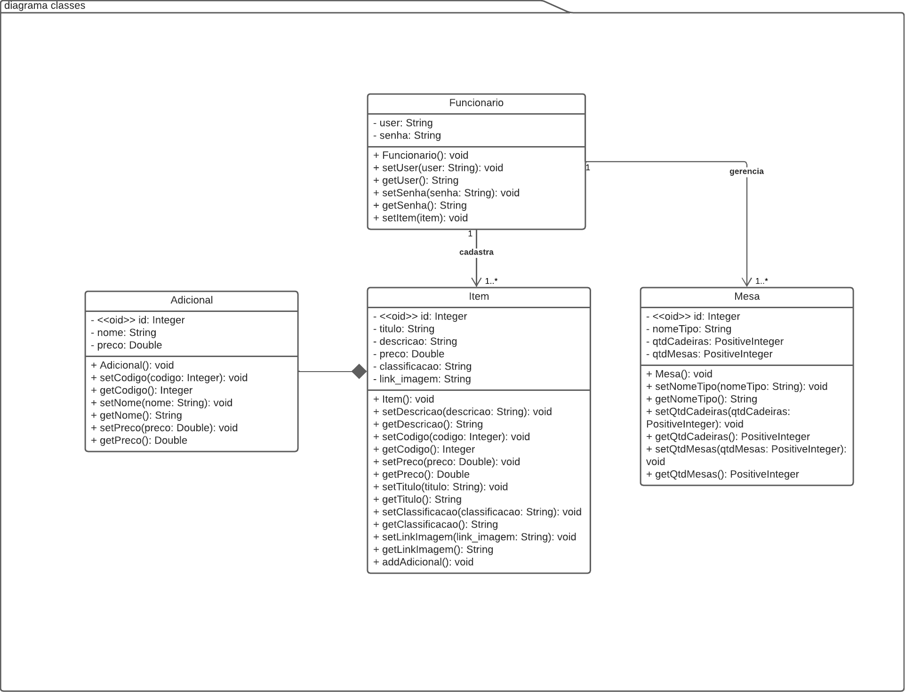

## Visão Lógica

A Visão Lógica é uma seção que descreve partes, arquiteturalmente, significantes do desenho do sistema, como, por exemplo, sua decomposição em subsistemas e pacotes. Cada pacote significante pode, caso seja necessário, ser decomposto em classes.

### Diagrama de Pacotes

Primeiramente, o Diagrama de Pacotes apresenta a arquitetura do projeto em pacotes e, assim, pode-se entender como a aplicação é desenvolvida de forma lógica. Os diagramas abaixo podem ser encontrados no [artefato](https://unbarqdsw2022-2.github.io/2022.2_G5_SoftSteakHouse/#/modelagem/diagramas_estaticos/diagrama_pacotes) específico dessa diagramação. Entretanto, aqui eles serão explicados cada um de forma mais específica.

<figcaption>Imagem: Diagrama de Pacotes Back-end</figcaption>
<figcaption>Autor: Abraão (Integrante do Grupo)</figcaption>

<figcaption>Imagem: Diagrama de Pacotes Front-end</figcaption>
<figcaption>Autor: Abraão (Integrante do Grupo)</figcaption>

Como pode ser visto, esses diagramas são compostos por pacotes que comunicam entre si e todos são de suma importância para o funcionamento do projeto. Então, para melhor compreensão, eles são explicados:

| Pacotes Pais | Nome | Descrição |
| :----------: | :--: | :-------- |
| Back-end | Settings | Pacote responsável pelas configurações da aplicação Django, além das urls que podem ser acessadas. |
| Back-end -> Settings | Settings Ambiente | Pacote que contém todas as configurações da instalação e funcionamento do sistema Django. |
| Back-end -> Settings | wsgi | Pacote que especificação para uma interface entre servidores web e aplicações web para Python. |
| Back-end -> Settings | urls | Pacote que contém o mapeamento de todas as urls da aplicação desenvolvida (para requests). |
| Back-end | App N | Pacote com a aplicação realmente desenvolvida. |
| Back-end -> App N | urls | Pacote que implementa as urls da aplicação. |
| Back-end -> App N | views | Pacote com as funções que recebem uma requisição e retorna uma retorna uma resposta (lógica de negócio, em si). |
| Back-end -> App N | serielizers | Pacote que implementa a conversão de tipos de dados em Python para REST. |
| Back-end -> App N | models | Pacote que é a fonte dos dados criados e manipulados no banco de dados (campos e comportamentos dos dados). |
| Back-end -> App N | migrations | Pacote responsável pela interação entre a models e o SGBD (banco de dados). |
| Front-end | routes | Pacote com as rotas da aplicação web. |
| Front-end | services | Pacote com classes ordinárias que contém funções de escolha própria. |
| Front-end | utils | Pacote com uma coleção de funções com propósito geral. |
| Front-end | views | Pacote com componentes para construir a interface do usuário. |
| Front-end | components | Pacote que implementam funções que trabalham em isolamento e retornam HTML. |
| Front-end | assets | Pacote que armazenam arquivos que são usados na aplicação de front-end. |

A aplicação de fato desses diagramas apresentados pode ser vista nos repositórios de [Front-end](https://github.com/UnBArqDsw2022-2/2022.2_G5_SoftSteakHouse_Frontend) e [Back-end](https://github.com/UnBArqDsw2022-2/2022.2_G5_SoftSteakHouse_Backend) do projeto.

### Diagrama de Classes

O diagrama de classes mostra a organização e composição das classes presentes no projeto. Relacionando com o diagrama de pacotes, eles estariam no models do Back-end, uma vez que seriam, então, implementados no banco de dados. Há um [artefato](https://unbarqdsw2022-2.github.io/2022.2_G5_SoftSteakHouse/#/modelagem/diagramas_estaticos/diagrama_classes) específico para esse tipo diagrama.

<figcaption>Imagem: Diagrama de Classes Atualizado - Entrega 4</figcaption>
<figcaption>Autor: Victor (Integrante do Grupo)</figcaption>

