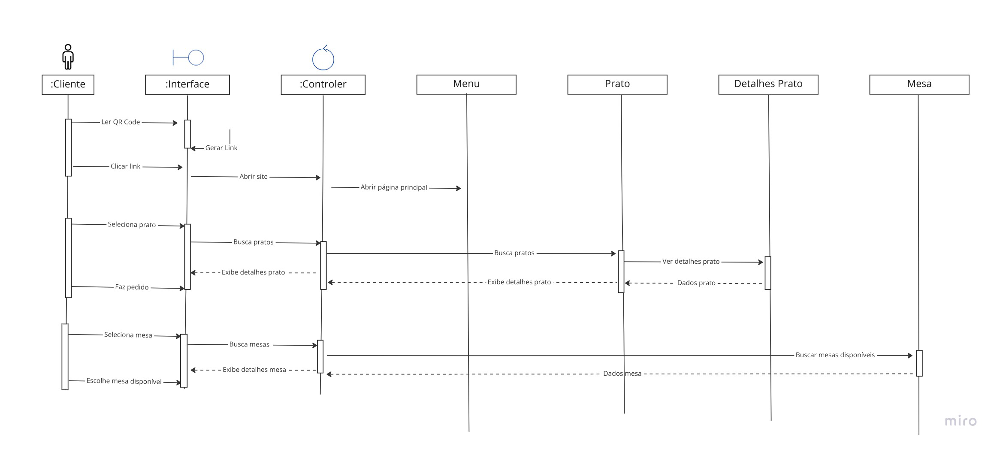

# Diagrama de sequência

## Introdução

O Diagrama de Sequência modela as interações entre objetos em um caso de uso. Ilustra como diferentes partes do sistema interagem entre si para realizar determinada função, e a ordem que as interações ocorrem quando um caso de uso é executado.

## Notações

É estruturado de forma que representa uma linha de tempo que começa no topo e desce gradualmente para marcar uma sequência de interações. Cada objeto tem uma coluna e as mensagens são trocadas por setas.

### Linha de vida

É exibida em um diagrama de sequência e é exibida com seu nome e tipo em um retângulo, que é chamado cabeça. A cabeça está localizada no topo de uma linha tracejada vertical, que representa o tempo da instância do objeto.

Quando possui um símbolo de ator é usada quando o diagrama de sequência pertence a um caso de uso.

### Entidade

Representa os dados do sistema. Por exemplo, uma aplicação de restaurante, a entidade Funcionário administraria todos os dados relacionados as mesas.

### Interface

Tela de interface entre sistema e usuário.

### Control

Organiza e programa as interações entre os limites e entidades e serve como mediador deles.

### Barras de Ativação

É usada para indicar que um objeto está ativo (ou instanciado) durante uma interação entre dois objetos. No caso do diagrama de sequência, quando um objeto envia uma mensagem para outro.

### Mensagem

Pode fluir em qualquer direção. Pode-se descrever a mensagem que está passando e, com cada tipo de seta você pode indicar o tipo de mensagem que está sendo enviada ou recebida.

## Diagrama

## Histórico de versão

| Data | Versão |Descrição |Autor | Revisor |
| -----|--------|----------|------|-------- |
| 03/12/2022 | 1.0.0| Elaboração do artefato de Diagrama de Implantação | [Taynara](https://github.com/TaynaraCris) | [Victor Leão](https://github.com/victorleaoo) |
| 03/12/2022 | 1.1.0| Correções gramaticais e escolha do diagrama correto | [Victor Leão](https://github.com/victorleaoo) | [Taynara](https://github.com/TaynaraCris) |

## Referências
SERRANO, Milene. Diagrama de Colaboração, 2022. Material apresentado na Disciplina de Arquitetura e Desenho de Software do curso de engenharia de software da UnB, FGA. Acesso em: 30 nov. 2022.

Linhas de Vida em Diagramas UML. Disponível em: https://www.ibm.com/docs/pt-br/rsm/7.5.0?topic=diagrams-lifelines-in-uml. Acesso em: 1 dez. 2022.

Tutorial do Diagrama de Sequência: Guia completo com exemplos. Disponível em: https://creately.com/blog/pt/diagrama/tutorial-do-diagrama-de-sequencia/. Acesso em: 3 dez. 2022.