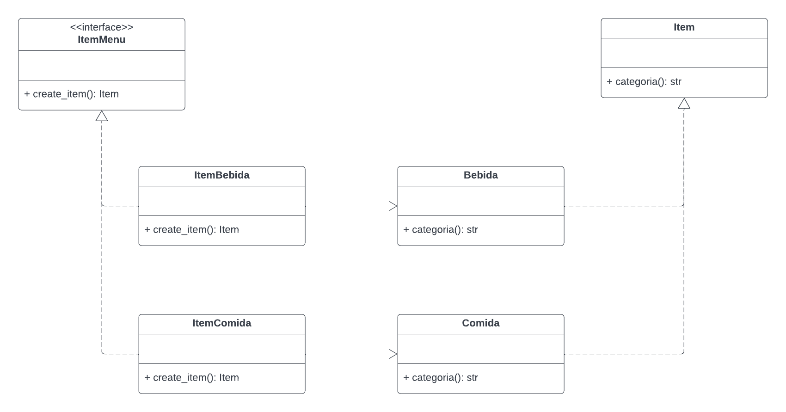

# Abstract Factory

## Introdução

O padrão de projeto Abstract Factory encapsula a escolha das classes concretas a serem utilizadas na  criação de objetos de diversas famílias.

Ele faz parte da categoria de GoFs Criacionais, que, como pode ser conferido no artefato de [GoFs](https://unbarqdsw2022-2.github.io/2022.2_G5_SoftSteakHouse/#/padroes-projeto/iniciativas_extras/gofs), são voltados para resolver dois problemas: definir qual classe concreta deve ser utilizada para criar um objeto; e definir como os objetos devem ser criados e como eles se relacionam com outros objetos do sistema.

## Metodologia

A partir do entendimento do padrão de projeto com estudos, o integrante do grupo Victor pensou em uma aplicação (exemplo) para a aplicação do Abstract Factory no escopo do projeto.

O padrão não foi realmente implementado ainda no projeto, mas a depender do desenvolvimento, pode-se chegar ao nível de ser implementado.

## Aplicação (Exemplo) no projeto

O padrão de projeto GoF Abstract Factory permite a produção de famílias de objetos relacionados sem ter que especificar suas classes concretas, de acordo com o site Refactoring Guru.

Dessa forma, no projeto Soft StakeHouse, o Abstract Factory atuaria na seguinte situação: muitos itens do menu podem ser de diferentes grupos (bebidas, quentes, frios, sobremesas etc.), assim, esse padrão de projeto ajudaria na criação desses diferentes tipos de objetos para essa classe.

## Modelagem (exemplo)



## Código (exemplo)

```
# Abstract Factory
class ItemMenu:
    def create_item(self) -> Item:
        pass

# Concrete Factory
class ItemBebida(ItemMenu):
    def create_item(self) -> Item:
        return Bebida()

# Concrete Factory
class ItemComida(ItemMenu):
    def create_item(self) -> Item:
        return Comida()

# Abstract Product
class Item:
    def categoria(self) -> str:
        pass

# Concrete Products
class Comida(Item):
    def categoria(self) -> str:
        print('Categoria: Comida')
        return 'Comida'

# Concrete Products
class Bebida(Item):
    def categoria(self) -> str:
        print('Categoria: Bebida')
        return 'Bebida'

```

## Histórico de Versões

|    Data    | Versão |            Descrição           |       Autor     |    Revisor    |
|  --------  |  ----  |            ----------          | --------------- |    -------    |
| 05/01/2023 |  1.0.0 |  Criação do artefato | [Victor Leão](https://github.com/victorleaoo) | [Marcos](https://github.com/Marofelipe) |

## Referências
SERRANO, Milene. GoFs, 2022. Material apresentado na Disciplina de Arquitetura e Desenho de Software do curso de engenharia de software da UnB, FGA. Acesso em: 05 jan. 2023.

REFACTORING GURU. Abstract Factory. Disponível em: https://refactoring.guru/pt-br/design-patterns/abstract-factory. Acesso em: 05 jan. 2023.

GEEKS FOR GEEKS. Abstract Factory Method – Python Design Patterns. Disponível em: https://www.geeksforgeeks.org/abstract-factory-method-python-design-patterns/. Acesso em: 05 jan. 2023.
