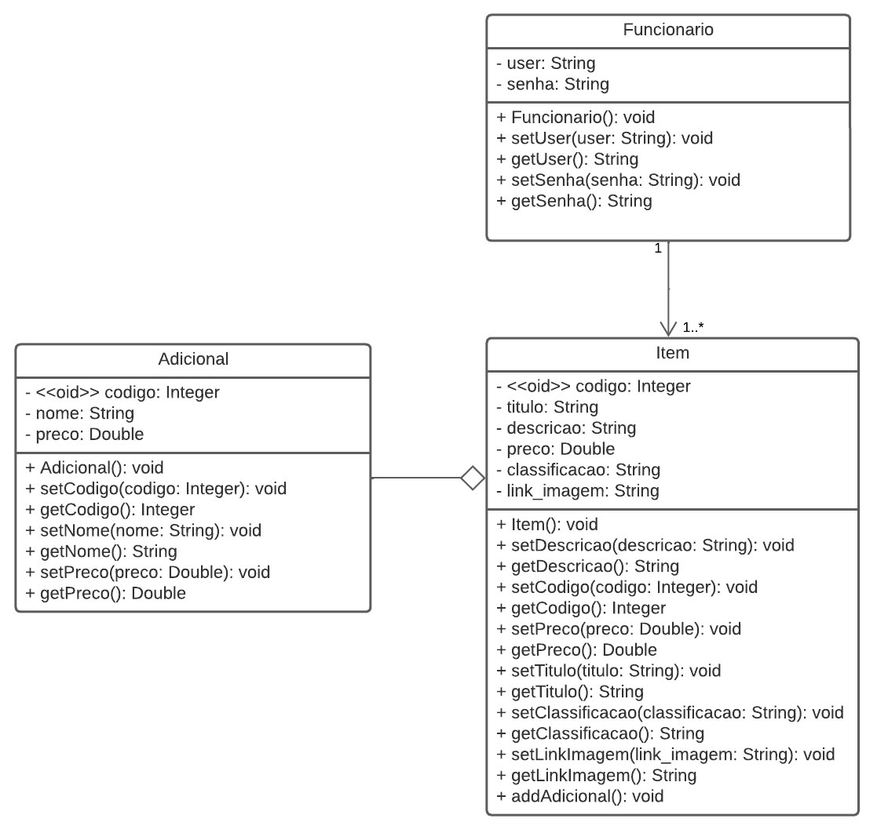

# 3.1. Módulo Padrões de Projeto GRASPs

## 3.1.1. Introdução

Introdução aqui...

## 3.1.2. GRASP Criador

GRASP Criador aqui...

## 3.1.3. GRASP Especialista

O padrão especialista envolve a distribuição consistente de responsabilidades entre as classes, ou seja, tem como objetivo atribuir a responsabilidade de algo para uma classe específica. 

Com isso temos um melhor encapsulamento das informações, fazendo com que o código seja mais fácil de entender e fazer manutenções futuras.

Caso alguma inforação necessária para implementar as reponsabilidades frequentes está associada a outros objetos diferentes, esses por sua vez são considerados especialistas parciais.

### Utilização no projeto:

 
*Imagem 1: Exemplo do uso de Grasp Especialista no projeto. Fonte: Próprio autor*

Como podemos ver no exemplo acima, existe um método dentro da classe "Item" responsável por adicionar informações extra ao item do cardápio. Isso faz com que a classe "Item" seja a especialista do método citado anteriormente

Podemos notar que o método que acrescenta informações adicionais ao item utiliza informações de outra classe, no caso a classe "Adicional", que por sua vez é uma especialista parcial.

## 3.1.4. GRASP de Alta Coesão

O padrão de projeto de alta coesão se refere à atribuição de responsabilidades de maneira a maximizar a coesão em uma classe ou módulo. Isso significa que todas as responsabilidades de uma classe ou módulo devem estar relacionadas e trabalhar em conjunto para atingir um objetivo comum.

Em geral, uma classe ou módulo com alta coesão é considerada mais fácil de entender, manter e testar, pois possui um propósito claro e bem definido. Além disso, é provável que uma classe ou módulo com alta coesão seja reutilizável em outros contextos, pois possui um conjunto de responsabilidades bem definido e não depende de outras classes ou módulos para realizar suas tarefas.

 
*Imagem 1: Diferença entre baixa e alta coesão. Fonte: https://unbarqdsw2022-1.github.io/2022.1_G2_DonAct/#/PadroesDeProjeto/3.1.GRASPs*

Na figura em blocos da esquerda exemplifica um projeto que é comum de ser encontrado no mercado de trabalho, sendo suas características: 
- Maior complexidade; 
- Dependência entre classes; 
- Forte acoplamento; 
- Baixa reutilização; 
- Maior impacto em mudanças; 
- Dificuldade na documentação e no entendimento; 
- Maior dificuldade na produção de testes.

Projeto esse que apresenta uma baixa coesão, ou seja, suas principais funções e classes estão interligadas de formas indesejáveis, dificultando o trabalho do profissional responsável. Já o projeto da direita apresenta um projeto mais difícil de se encontrar, com raras características: 
- Menor complexidade; 
- Maior reutilização; 
- Dependendo da situação até inutiliza a função da documentação, essa que é muito mais simples e consideravelmente entendível;
- Mudanças impactam minimamente o sistema;
- Baixo acoplamento;
- Testes coerentes e fáceis de serem alterados. 

No projeto do grupo 5, foi definido desde o começo que desenvolveríamos com o padrão de projeto de alta coesão, apesar de levar tempo e não ser a tarefa mais fácil, é recompensador a longo prazo. Isto é, conforme os requisitos do produto eram alterados, o impacto no projeto não foi e nem está sendo custoso. Para exemplificar melhor esse padrão de projeto serão apresentados exemplos no Back e Front-end.

No Front-end, um exemplo claro desse padrão de projeto é na função responsável por consumir a API (Back-end). Normalmente, quando visitamos projetos React.js vemos indivíduos utilizando as suas funções de consumo de API dentro dos arquivos ou funções que geram as telas, porém, para o nosso projeto decidimos generalizar a função, de uma forma que independa da requisição feita, precisando apenas receber o endpoint desejado como argumento, e se precisar de informações adicionais colocamos um argumento optativo. Dessa forma tornamos uma parte do código reutilizável, tendo em vista que precisamos acessar os dados da API em diferentes telas do sistema.

 
*Imagem 2: Função responsável por consumir uma API. Fonte: Autores do documento*

No Back-end, um exemplo mais simples é a utilização do padrão gerado pelo Django, ou seja, quando construímos um projeto em Django (utilizando os comandos recomendados), é gerado um conjunto de pastas e arquivos, sendo que cada um tem a sua própria função. Nossa equipe decidiu seguir os padrões conforme o Django dita, utilizando cada arquivo para sua função pré-definida, assim a divisão do projeto fica mais clara, intuitiva para novos contribuintes, e menos impactante com mudanças.

 
*Imagem 3: Conjunto de arquivos padrões do Django. Fonte: Autores do documento*

*Note*: As imagens apresentadas podem ser alteradas, tendo em vista que o projeto está em constante desenvolvimento.

# 3.2 Referências

* SILVA. Ramon. Página do Engenheiro Ramon Ferreira Silva: Padrões GRASP. Rio de Janeiro, 10 mar. 2021. Disponível em: https://www.ramonsilva.net/post/alta-coes%C3%A3o-padr%C3%B5es-grasp. Acesso em: 02 de janeiro de 2023.
* Projeto semestre anterior: Módulo Padrões de Projeto GRASPs. Disponível em: https://unbarqdsw2022-1.github.io/2022.1_G2_DonAct/#/PadroesDeProjeto/3.1.GRASPs. Acesso em: 02 de janeiro de 2023.

## Histórico de Versões

|    Data    | Versão |            Descrição           |       Autor     |    Revisor    |
|  --------  |  ----  |            ----------          | --------------- |    -------    |
| 01/01/2023 |  0.0.1 |  Configuração inicial do artefato de Padrões GRASPs | [Caio César](https://github.com/oCaioOliveira) | [Hian Praxedes](https://github.com/HianPraxedes) |
| 01/01/2023 |  0.1.0 |  Adição do padrão de projeto de alta coesão | [Caio César](https://github.com/oCaioOliveira) | [Hian Praxedes](https://github.com/HianPraxedes) |
| 05/01/2023 |  0.1.1 |  Adição do padrão de projeto GRASP Especialista | [Hian Praxedes](https://github.com/HianPraxedes) | - |
